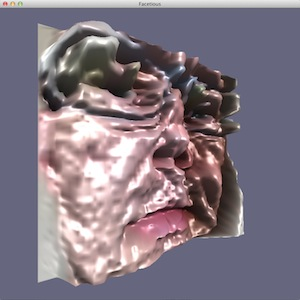

Facetious
=========

By Philip M. Hubbard, 2013

Overview
--------

Facetious is an application that tracks the user's face to generate odd but intriguing 3D animations.  The video of the face is mapped onto a surface and warped, with the third dimension coming from the luminance (perceived brightness) at each pixel.  As the video is updating the warped face, the surface animates through a slow pattern of turning and nodding.

Facetious is also an experiment of sorts.  It is an experiment in doing unusual work in an OpenGL vertex shader, where the warping of the face is computed.  It is an experiment in making Apple's Objective-C libraries for accessing a computer's video camera, and for tracking faces in video images, available from C++.

Implementation
--------------

Facetious is a Cocoa application.  Its `AppDelegate`sets the window to an instance of a class derived from `NSOpenGLView`.  In particular, it is an `AocNSOpenGLView`, defined in the Aoc library. `AocNSOpenGLView` is written in Objective-C++ (i.e., its source files has the ".mm" file extension) so it can have an Objective-C API and an internal C++ data member, a `Aoc::CppNSOpenGLBase` pointer.  `FacetiousCppNSOpenGL` is derived from `Aoc::CppNSOpenGLBase` and implements virtual functions to handle OpenGL initialization, window resizing and window redrawing.  These virtual functions implement the main logic of the application.

Getting the `FacetiousCppNSOpenGL` created and made available to the `AocNSOpenGLView` requires a bit of indirection.  `AppDelegate` is pure Objective-C, so it cannot create the C++ `FacetiousCppNSOpenGL `instance directly.  It can, however, call a pure C function declared in a pure C header file.  So it imports FacetiousInit.h, which declares `facetiousInit()`.  In FacetiousInit.cpp, `facetiousInit()` is labeled `extern "C"`, so `AppDelegate` sees its name without C++ name mangling.  The implementation of `facetiousInit()` simply passes to `Aoc::CppNSOpenGLBas`e a function to call to create the `FacetiousCppNSOpenGL` instance.

`FacetiousCppNSOpenGL` gets video from an instance of `Aoc::CppAvFoundationCamera`.  This class is a C++ wrapper for the Objective-C `AVFoundationCamera` class.  `FacetiousCppNSOpenGL` processes the video to find the user's face through an instance of `Aoc::CppCIDetector`.  That class is a C++ wrapper for the Objective-C `CIDetector` class.

`CIDetector` can be slow.  So the `Aoc::CppCIDetector` instance runs in its own thread, one of several used by Facetious.  The detector thread uses a condition variable to wait until it receives a new video image from the `Aoc::CppAvFoundationCamera` instance.  When the thread's `Aoc::CppCIDetector` instance finds a face, it sets another condition variable to notify the application's main thread.  The main thread performs OpenGL operations.  It updates a texture to include the detected face's region in the video image.  Rendering of the surface with this texture is triggered by another thread, which generates redraw requests at a rate of 30 frames per second.  At each redraw, the main thread advances the animation of the surface and renders it with the latest face texture.  The rendering thus proceeds smoothly at a high frame rate even when the the face detector is running more slowly.

The surface onto which the face texture is mapped is defined as a flat grid of vertices. The OpenGL vertex shader computes a height for each vertex based on the luminance of the face texture at the vertex.  It computes each vertex's surface normal vector based on adjacent pixels in the texture.  Other than this specific algorithm, much of the code of the shader is factored out into classes in the Agl library.  Agl implements basic tasks common to vertex and fragment shaders, shader programs, textures and surfaces.  The animation of the surface uses code from another library, Aut.  Aut has classes to define animations as sequences of ease-in-ease-out interpolations with specific durations.  Aut also provides code for a running-average computation that Facetious uses to stabilize the sometimes-jittery results of the face tracker.

The luminance-based height field changes more gradually and looks more interesting if it is computed from a relatively low resolution texture.  So the main thread uses a utility routine from Agl to reduce the resolution of the latest face image down to 64 by 64 pixels.  The user can override this setting, as described next.

User Interface
--------------

The main thread of Facetious also processes a simple set of keyboard commands.

* The arrow keys stop the animation and change the surfaces rotation angles directly.
* The spacebar restarts the animation.
* The 'b' key brightens the lighting, and the 'B' key darkens it.
* The 'l' key cycles between fragment shaders for different lighting models.  Currently, Facetious supports two lighting models: 
a simple Phong model with one directional light, and spherical harmonics encoding of diffuse global illumination.
* The 'r' key reduces the resolution of the face texture by a factor of two (to a minimum of 32 by 32), and the 'R' key doubles the resolution.
* The 's' key toggles stabilization of the facial tracker's results off and on.

Building
--------

Since Facetious is a Cocoa application, it requires an Apple OS X platform.  In particular, the Aoc library uses the following frameworks: ApplicationServices.framework, AVFoundation.framework, CoreMedia.framework, OpenGL.framework, QuartzCore.framework.  Aoc also requires a compiler that supports Objective-C++ in addition to Objective-C and C++.  The particular version of Xcode used for Facetious development was 4.6.3.  The Xcode project settings are stored in Facetious.xcodeproj.

As mentioned above, Facetious depends on the Aoc, Agl and Aut libraries.  An Xcode workspace is convenient when developing an application that uses code from multiple projects, and Facetious.xcworkspace/contents.xcworkspacedata stores the settings for a workspace for Facetious.

Facetious and Agl also depend on the Imath library from the IlmBase part of the OpenEXR project.  This code is available on Github or from http://www.openexr.com/downloads.html.

The Xcode project build settings assume that all projects---Facetious, Aoc, Agl and Aut---are siblings at the same level in the directory hierarchy, and that Imath has been installed with header files in /usr/local/include and libraries in /usr/local/lib.  Aoc, Agl and Aut have header files in a "src" subdirectory.  So in the project build settings, the "Header Search Paths" is set to "$(SRCROOT)/../Aoc/src $(SRCROOT)/../Agl/src $(SRCROOT)/../Aut/src /usr/local/include", allowing Facetious code to have include statements like the following:

	#include "AutAnim.h"
	#include <OpenEXR/ImathMatrix.h>

The Aoc, Agl and Aut projects have build settings of "Installation Directory" to "@rpath".  This setting allows those library to be found when they are embedded in the Facetious application bundle.  Facetious has a build setting of "Runpath Search Paths" to "@loader_path/../Frameworks" and a "Copy Files" build phase to copy those library into the Frameworks section of its bundle.

The Agl and Aut libraries, and the FacetiousCppNSOpenGL code that implements most of the application's features, are written in C++ only.  They do use a few C++11 features, but it would not be difficult to remove those features, assuming that an appropriate version of Boost is available to replace some STL capabilities, like threading and timing operations.

